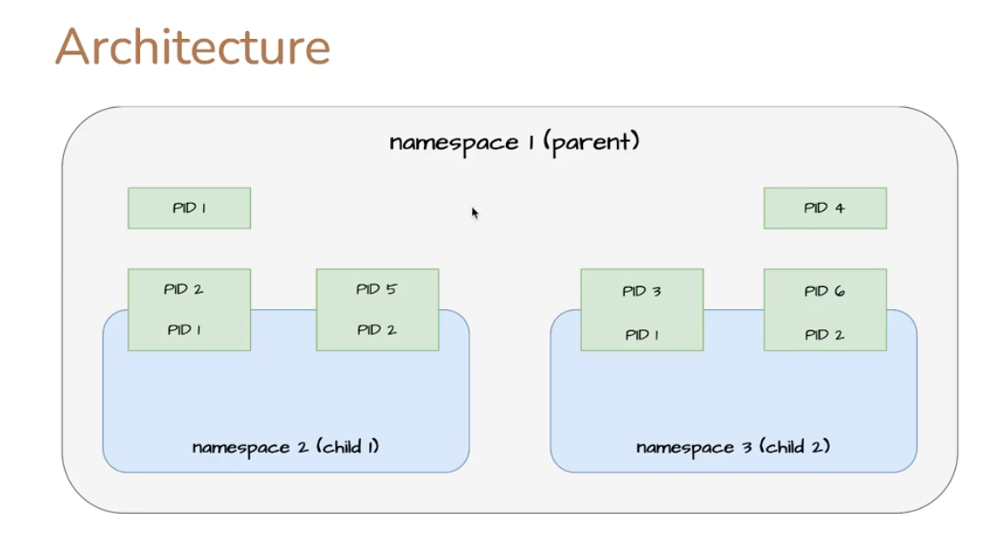

# **Scenario: PID Namespace Isolation**

## **Summary**
In this scenario, we create a parent namespace and two child namespaces. The parent namespace has full visibility into the processes running in all namespaces, while each child namespace can only list the PIDs within its own namespace.

### **Diagram Representation**


## **Step-by-Step Implementation**

### **1. List All Processes in the Current Namespace**
Before creating new namespaces, we list all processes running in the default PID namespace:
```bash
ps -ef
```
This displays all system processes visible in the global PID namespace.

---
### **2. Create a New PID Namespace**
We use `unshare` to create a new PID namespace, forking a new shell:
```bash
sudo unshare --pid --fork --mount-proc /bin/bash
```
- `--pid` → Creates a new PID namespace.
- `--fork` → Forks a new process within this namespace.
- `--mount-proc` → Ensures that `/proc` is correctly mounted within the new namespace.

At this point, we are inside a new PID namespace, separate from the original system namespace.

---
### **3. Verify PID Namespace Isolation**
Inside the newly created namespace, check the process list:
```bash
ps -ef
```
- This will only show the processes running inside the newly created namespace.
- PID 1 in this namespace corresponds to the new `bash` shell started by `unshare`.

Now, switch back to the parent namespace and inspect all process namespaces:
```bash
ps -efo pidns,pid,args
```
- `pidns` → Displays the namespace ID for each process.
- `pid` → Shows the process ID.
- `args` → Displays the command executed.

In the output:
- The parent namespace will list all PIDs, including those in child namespaces.
- The child namespaces will only show their own PIDs.

### **Conclusion**
This setup demonstrates how PID namespaces provide process isolation. The parent namespace retains visibility over all child namespaces, whereas child namespaces remain isolated, only aware of their own processes.

