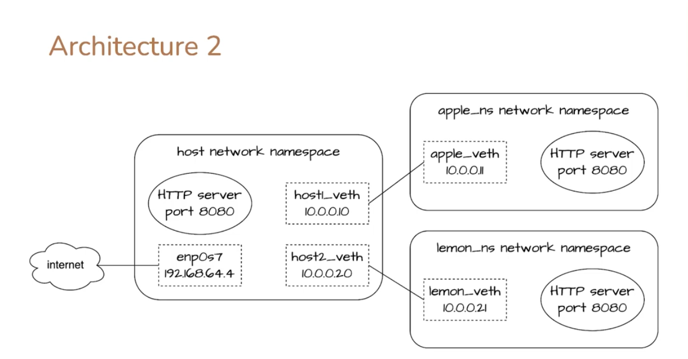

# Scenario 2: Connecting Two Network Namespaces via a Bridge

## Summary

This scenario demonstrates how to enable network communication between two isolated network namespaces (`apple_ns` and `lemon_ns`) using a virtual Ethernet (veth) pair and a Linux bridge. Additionally, it ensures that both namespaces have internet access.



---

## Creating the First Namespace (Apple)

Run a script `apple.sh` to set up the `apple_ns` namespace:

---

## Creating the Second Namespace (Lemon)

Run a script `lemon.sh` to set up the `lemon_ns` namespace:
---

## Addressing Routing Conflicts

### Problem: Overlapping Routes

When setting up the namespaces, the routing table on the host will show conflicting routes:

```sh
ip route show
```

```
default via 192.168.1.1 dev ens33 proto dhcp src 192.168.1.159 metric 100
10.0.0.0/24 dev host1_veth proto kernel scope link src 10.0.0.10
10.0.0.0/24 dev host2_veth proto kernel scope link src 10.0.0.20
```

### Solution: Using a Bridge

Instead of assigning direct routes, we create a Linux bridge to interconnect the namespaces.

---

## Setting Up the Bridge

```sh
# Create a bridge
ip link add dev host_bridge type bridge

# Assign an IP address to the bridge
ip address add 10.0.0.1/24 dev host_bridge

# Bring the bridge interface up
ip link set host_bridge up

# Attach the veth interfaces to the bridge
ip link set dev host1_veth master host_bridge
ip link set dev host2_veth master host_bridge
```

### Updating Default Routes in Namespaces

```sh
# Update the routing table in apple_ns
ip netns exec apple_ns ip route delete default via 10.0.0.10
ip netns exec apple_ns ip route add default via 10.0.0.1

# Update the routing table in lemon_ns
ip netns exec lemon_ns ip route delete default via 10.0.0.20
ip netns exec lemon_ns ip route add default via 10.0.0.1
```

### Removing Old IP Addresses

```sh
ip address delete 10.0.0.10/24 dev host1_veth
ip address delete 10.0.0.20/24 dev host2_veth
```

---

## Testing Connectivity

Check basic connectivity between namespaces:

```sh
ping 10.0.0.11 -c 1
ping 10.0.0.21 -c 1

ip netns exec apple_ns ping 10.0.0.21 -c 1
ip netns exec apple_ns curl -v http://10.0.0.21:8080
```

### Enabling Internet Access

Allow packets to be forwarded between the bridge and the external network:

```sh
# Allow traffic forwarding between bridge and external network
iptables --append FORWARD -i host_bridge -o enp0s3 -j ACCEPT
iptables --append FORWARD -i enp0s3 -o host_bridge -j ACCEPT
```

Test internet connectivity from within the namespaces:

```sh
ip netns exec apple_ns ping 8.8.8.8 -c 1
ip netns exec lemon_ns ping 8.8.8.8 -c 1
```

---

## Cleanup Script

To clean up the environment after testing run cleanUpPart2.sh

---

## Conclusion

By utilizing a bridge, we successfully interconnected two network namespaces while also providing them with external internet access. This approach prevents routing conflicts and creates a more scalable network configuration.

---
